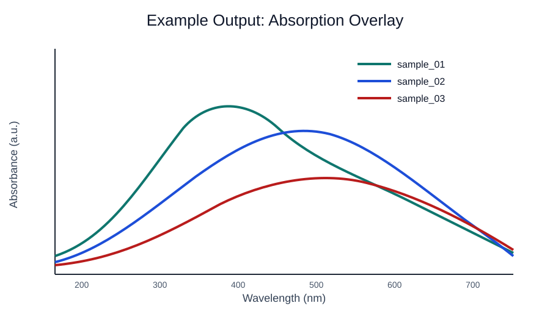
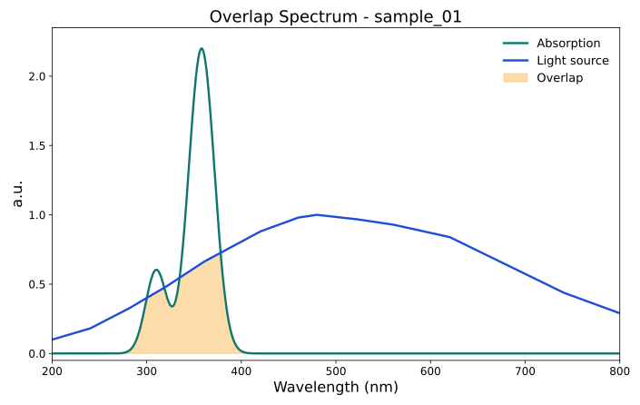

# Overlap Calculator

[](https://github.com/pinarsyt/overlap-calculator/actions/workflows/ci.yml)
[](https://doi.org/10.5281/zenodo.19944515)
[](LICENSE)
[](https://www.python.org/downloads/release/python-3120/)

`overlap-calculator` is a reproducible batch toolkit for quantifying how well
a molecular absorption spectrum overlaps a reference light source. It accepts
both **theoretical** (Gaussian TD-DFT `.out`) and **experimental**
(`.csv`/`.xlsx`/`.xls`) inputs in the same run, broadens each TD-DFT
spectrum with both **Gaussian** and **Lorentzian** line shapes, and reports
per-light-source absorbed-flux, absorbed-fraction, and shape-overlap metrics
together with publication-grade TIFF plots.

---

## Documentation

| Resource                                                     | Content                                                 |
| ------------------------------------------------------------ | ------------------------------------------------------- |
| [docs/MANUAL.md](docs/MANUAL.md)                             | Complete user manual (Markdown)                         |
| [docs/MANUAL.tex](docs/MANUAL.tex)                           | LaTeX source of the manual                              |
| [docs/MANUAL.pdf](docs/MANUAL.pdf)                           | Typeset PDF build of the manual                         |
| [case_studies/](case_studies/)                               | Reproducible end-to-end worked examples on bundled data |
| [docs/postman_collection.json](docs/postman_collection.json) | Postman collection for the HTTP API                     |

---

## Features

- Mixed batches: theoretical TD-DFT `.out` and experimental CSV/XLSX/XLS
  in the same run.
- Side-by-side **Gaussian** and **Lorentzian** broadening for every TD-DFT
  input.
- **Prefactor modes**: `constant` (default, validated for 200–800 nm) and
  `frequency-resolved` (keeps the wavenumber factor inside the integrand;
  relevant for NIR bands).
- **Broadening width modes**: `fixed` (default, uniform `--sigma-ev`) and
  `marcus-hush` (per-transition classical Marcus–Hush width
  `σ = sqrt(2·λ·k_B·T)` from `--reorganization-ev` and `--temperature-k`).
- **Calibration**: optional TOML block that applies a linear energy map
  `E_cal = a·E + b`, an oscillator-strength scaling `f_cal = α·f`, and
  per-band width overrides before broadening (`--calibration PATH`; CLI
  and library only).
- Bundled reference light sources: **AM1.5G** (NREL ASTM G-173) and
  **LEDB1**, **LEDB2**, **LEDB3**, **LEDB4**, **CIEFL10** from the CIE 015:2018
  reference illuminant data sets (International Commission on
  Illumination, <https://cie.co.at/>) — see
  [Acknowledgement of third-party data](#acknowledgement-of-third-party-data)
  for full citations. Optional user-supplied CSV light sources are
  also accepted.
- Molar absorptivity in `M⁻¹ cm⁻¹` via the standard
  oscillator-strength prefactor, Beer–Lambert absorptance, and absorbed-flux
  integrals.
- Per-row unit metadata (`absorption_unit`, `light_source_unit`,
  `absorbed_flux_unit`) so downstream pipelines know what each number means.
- **Provenance**: every run writes `run_manifest.json` in the output root,
  capturing software version, git commit, UTC timestamp, resolved
  parameters, and SHA-256 of every input file.
- Publication-ready TIFF plots per sample, per light source, and per
  (sample, light) pair, with the overlap region shaded.
- **Ranking outputs**: grouped tables (`ranking_by_light_source__<metric>`,
  `ranking_by_sample__<metric>`) and per-group bar charts that rank
  every molecule against every light source — and vice versa — under
  each of the four overlap metrics (gaussian/lorentzian × `absorbed_fraction`/`shape_overlap`).
- Structured CSV / JSON / XLSX exports including a descriptor summary and
  an explicit `skipped_inputs` report for any files that could not be
  analysed.
- **Public Python API**: importable as a library — `from overlap_calculator
  import analyze` — with a fully typed, stable public surface.
- First-class CLI (Typer) and HTTP API (Flask) interfaces; reproducible
  environments via `pyproject.toml`, `environment.yml`, and Docker.

---

## Installation

Requires **Python 3.12.x**.

```bash
# Conda (recommended)
conda env create -f environment.yml
conda activate overlap-calculator
pip install -e .

# or, plain venv
python -m venv .venv
source .venv/bin/activate          # Linux / macOS
# Windows PowerShell: .venv\Scripts\Activate.ps1
pip install -e .

# or, Docker (API only) — host port 8080 → container port 8000
docker build -t overlap-calculator .
docker run --rm -p 8080:8000 overlap-calculator
```

---

## Quick Start

```bash
# Generate a normalised input manifest from a folder of raw files
overlap-calculator generate-input --files-dir input/files --out input/input.json

# Run the full pipeline
overlap-calculator analyze --input input/input.json --out output

# Optional: raise plot resolution for publication figures
overlap-calculator analyze --input input/input.json --out output_600dpi --plot-dpi 600

# Optional: skip the ranking tables and bar charts
overlap-calculator analyze --input input/input.json --out output --no-ranking-outputs

# Optional: frequency-resolved prefactor (relevant for NIR bands)
overlap-calculator analyze --input input/input.json --out output --prefactor-mode frequency-resolved

# Optional: Marcus-Hush broadening width
overlap-calculator analyze --input input/input.json --out output --sigma-mode marcus-hush --reorganization-ev 0.30

# Optional: apply a calibration TOML
overlap-calculator analyze --input input/input.json --out output --calibration cal.toml
```

Outputs land under `output/tables/` (CSV/JSON/XLSX, including
`ranking_by_light_source__<metric>` and `ranking_by_sample__<metric>`
for each of the four overlap metrics), `output/plots/` (TIFF, 400 dpi
by default; ranking bar charts under `plots/ranking/`), and
`output/run_manifest.json` (provenance record). See
[docs/MANUAL.md](docs/MANUAL.md) for the full command reference,
input/output schema, and the derivations behind every metric.

---

## Use as a library

`overlap_calculator` exposes a fully typed public API that lets you
drive the same pipeline from Python without the CLI:

```python
from overlap_calculator import analyze
from overlap_calculator.models import AnalysisInput

items = [AnalysisInput(input_type="theoretical", source_path="tddft.out", sample_id="dye-1")]
results, skipped = analyze(items, default_light_sources=["AM15G"])
```

Public names importable from `overlap_calculator`:

| Name | Purpose |
| ---- | ------- |
| `analyze` | High-level entry point: full pipeline, returns `(list[RunResult], list[AnalysisSkip])` |
| `analyze_inputs` | Lower-level batch runner |
| `export_results` | Write tables and plots from a `results` list |
| `prepare_output_dir` | Create the output directory tree |
| `build_extinction_spectrum` | Reconstruct ε(λ) from TD-DFT excited states |
| `compute_absorbance` | Beer–Lambert A(λ) = ε·c·L |
| `compute_absorptance` | α(λ) = 1 − 10^(−A) |
| `shape_overlap` | Dimensionless spectral shape comparator |
| `integrate_light_flux` | ∫ I(λ) dλ |
| `integrate_absorbed_flux` | ∫ α(λ)·I(λ) dλ |
| `load_light_sources` | Load bundled and custom light sources |
| `marcus_hush_sigma_ev` | σ = sqrt(2·λ·k_B·T) in eV |
| `Calibration` | Pydantic model for the calibration block |
| `load_calibration` | Parse a TOML calibration file |
| `apply_calibration` | Apply a calibration to a list of excited states |
| `build_run_manifest` | Assemble a provenance manifest dict |
| `write_run_manifest` | Write `run_manifest.json` to disk |
| `__version__` | Installed package version string |

---

## HTTP API

Two deployment flavours:

- **Native Flask** (`python -m overlap_calculator.api.app`) listens on
  port **8000** directly.
- **Docker** (either `docker run -p 8080:8000` or `docker compose up`)
  publishes the container's port 8000 on host port **8080**, so the
  two can run side by side.

```bash
# Native Flask — port 8000
curl http://localhost:8000/health                       # => {"status": "ok"}

curl -X POST http://localhost:8000/analyze \
  -F "files=@input/files/theoretical.out" \
  -F "files=@input/files/experimental.xlsx" \
  -F "plot_dpi=400" \
  -F "ranking_outputs=true" \
  --output analysis_outputs.zip

# Docker — port 8080 (same payload, only the host port changes)
curl http://localhost:8080/health
```

The `/analyze` endpoint returns a ZIP archive containing the same files
`overlap-calculator analyze` would have written.

---

## Example Output

Representative absorption overlay and spectrum / light-source overlap
(TIFFs are 400 dpi by default; use `--plot-dpi 600` for larger
publication-resolution exports):





---

## Citation

If you use `overlap-calculator` in published work, please cite the
concept DOI below. It resolves to the latest archived release on
Zenodo, so the citation stays valid across versions without needing
an update.

```bibtex
@software{seyitdanlioglu_overlap_calculator,
  author    = {Seyitdanlıoğlu, Pınar},
  title     = {{overlap-calculator}: Batch spectral-overlap analysis
               between TD-DFT / experimental absorption and reference
               light sources},
  year      = {2026},
  publisher = {Zenodo},
  doi       = {10.5281/zenodo.19944515},
  url       = {https://doi.org/10.5281/zenodo.19944515}
}
```

---

## Acknowledgement of third-party data

The bundled CIE LED illuminants (`LEDB1`, `LEDB2`, `LEDB3`, `LEDB4`)
and fluorescent illuminant (`CIEFL10`) are official **CIE** data sets
derived from _CIE 015:2018 Colorimetry, 4th Edition_. The `AM15G`
spectrum is the ASTM G-173-03 AM1.5 global reference distributed by
the U.S. National Renewable Energy Laboratory (NREL). The bundled
experimental absorbance workbook
(`input/files/organic_uvvis_photochemcad_dataset.xlsx`) is derived
from the **PhotochemCAD** spectral database. If you use
`overlap-calculator` in published work, please cite the data sets
alongside the software:

> CIE (2018). _Relative spectral power distributions of illuminants
> representing typical LED lamps, 1 nm spacing._ International
> Commission on Illumination, Vienna, AT.
> DOI: [10.25039/CIE.DS.dhcw57sd](https://doi.org/10.25039/CIE.DS.dhcw57sd)

> CIE (2018). _Relative spectral power distributions of illuminants
> representing typical fluorescent lamps, 1 nm wavelength steps._
> International Commission on Illumination, Vienna, AT.
> DOI: [10.25039/CIE.DS.54hy6srn](https://doi.org/10.25039/CIE.DS.54hy6srn)

> CIE (2018). _CIE 015:2018 Colorimetry, 4th Edition._
> International Commission on Illumination, Vienna, AT.
> <https://cie.co.at/publications/colorimetry-4th-edition/>

> NREL. _Reference Air Mass 1.5 Spectra (ASTM G-173-03)._ U.S.
> National Renewable Energy Laboratory.
> <https://www.nrel.gov/grid/solar-resource/spectra-am1.5.html>

> Taniguchi, M., & Lindsey, J. S. (2018). Database of absorption and
> fluorescence spectra of >300 common compounds for use in PhotochemCAD.
> _Photochemistry and Photobiology_, **94**(2), 290–327.
> DOI: [10.1111/php.12860](https://doi.org/10.1111/php.12860)

BibTeX:

```bibtex
@techreport{cie_led_illuminants_2018,
  author      = {{International Commission on Illumination}},
  title       = {Relative spectral power distributions of illuminants
                 representing typical {LED} lamps, 1\,nm spacing},
  institution = {CIE Central Bureau},
  address     = {Vienna, AT},
  year        = {2018},
  doi         = {10.25039/CIE.DS.dhcw57sd},
  url         = {https://doi.org/10.25039/CIE.DS.dhcw57sd}
}

@techreport{cie_fl_illuminants_2018,
  author      = {{International Commission on Illumination}},
  title       = {Relative spectral power distributions of illuminants
                 representing typical fluorescent lamps, 1\,nm wavelength steps},
  institution = {CIE Central Bureau},
  address     = {Vienna, AT},
  year        = {2018},
  doi         = {10.25039/CIE.DS.54hy6srn},
  url         = {https://doi.org/10.25039/CIE.DS.54hy6srn}
}

@techreport{cie_015_2018,
  author      = {{International Commission on Illumination}},
  title       = {{CIE} 015:2018 Colorimetry, 4th Edition},
  institution = {CIE Central Bureau},
  address     = {Vienna, AT},
  year        = {2018},
  isbn        = {978-3-902842-13-8}
}

@misc{nrel_am15g,
  author       = {{National Renewable Energy Laboratory}},
  title        = {Reference Air Mass 1.5 Spectra ({ASTM} {G-173-03})},
  howpublished = {\url{https://www.nrel.gov/grid/solar-resource/spectra-am1.5.html}},
  institution  = {U.S. Department of Energy}
}

@article{taniguchi_lindsey_photochemcad_2018,
  author  = {Taniguchi, Masahiko and Lindsey, Jonathan S.},
  title   = {Database of Absorption and Fluorescence Spectra of
             {>}300 Common Compounds for Use in {PhotochemCAD}},
  journal = {Photochemistry and Photobiology},
  volume  = {94},
  number  = {2},
  pages   = {290--327},
  year    = {2018},
  doi     = {10.1111/php.12860},
  url     = {https://doi.org/10.1111/php.12860}
}
```

Please consult the CIE at <https://cie.co.at/> for the authoritative
reference tables and the latest errata.

---

## License

`overlap-calculator` is released under the **GNU General Public License
v3.0 or later** (GPL-3.0-or-later). See [LICENSE](LICENSE) for the full
text.
